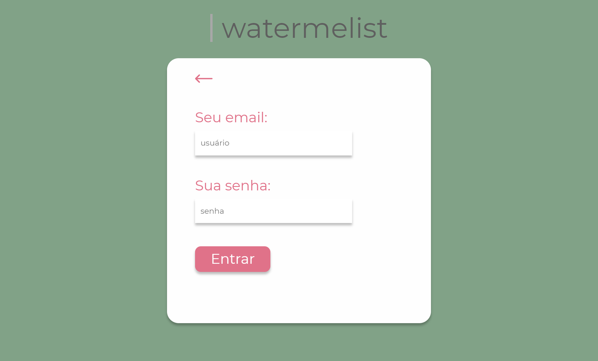

# Watermelist

## &#128444; screenshots:
</img>
</img>
</img>
</img>

## Watermelist is a project fully designed and developed by me

### Technologies used:
- HTML
- CSS
- JS

### Managed by:
- object-oriented paradigm
- grid / flexbox layouts
- responsive web design
- IndexedDB
